# Robótica en el CEIP Sierra Nevada

El objetivo de este taller es montar y programar un robot sencillo.

Tendrá dos ruedas, cada una con su motor, lo que permitirá que haga giros complejos.

Le añadiremos sensores de obstáculos y lo programaremos para que los evite y ¡para que no se caiga de la mesa!

Estas son las piezas del robot que vamos a montar

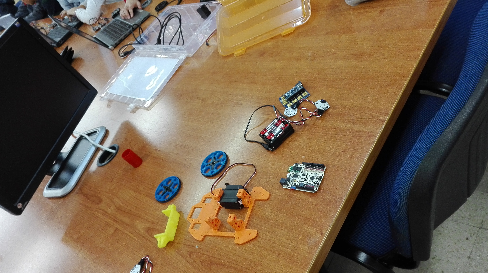

Las piezas que hemos usado están diseñadas e impresas con una impresora 3D, ([sus diseños](https://github.com/javacasm/evoPrintBot))

Para la programación usaremos [BitBloq](http://bitbloq.bq.com), una herramienta de programación para Arduino, creada por Bq, que usa bloques para la creación de programas . Es gratuita y de código abierto y podemos usarla online.

Todos los contenidos de este taller (diseños de las piezas, programas y las herramientas que hemos usado) se distribuyen con licencia buerta CC, eso quiere decir que se pueden distribuir libremente, es más se agradece que se comparta. Podemos resumirlo en que es un anti-copyright. Si te interesa el tema puedes leer más en [este enlace](http://www.psicobyte.com/descargas/CampusCientifico.pdf).

## Día 6-5-2016

Hoy, para empezar haremos montajes y programas sencillos.

### Componentes de un robot

Hemos empezado la clase hablando de los componentes que tiene un robot y los que tendrá el que montaremos. Hemos identificado estas piezas con las que hay en la caja:

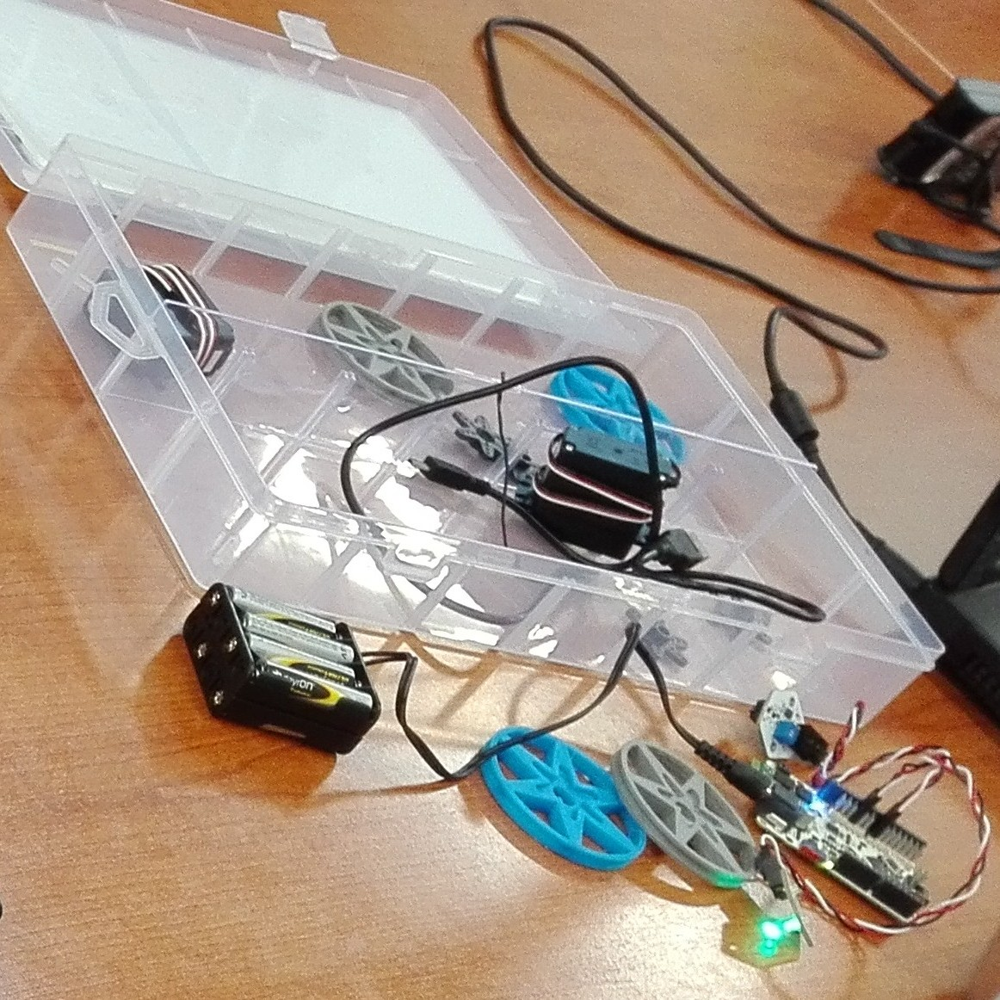

### Haciendo parpadear un led

A continuación preparamos el primer montaje dónde ya identificamos algunos de los componentes que vamos a usar como el microprocesador (Arduino)

Primero diseñándolo en el ordenador

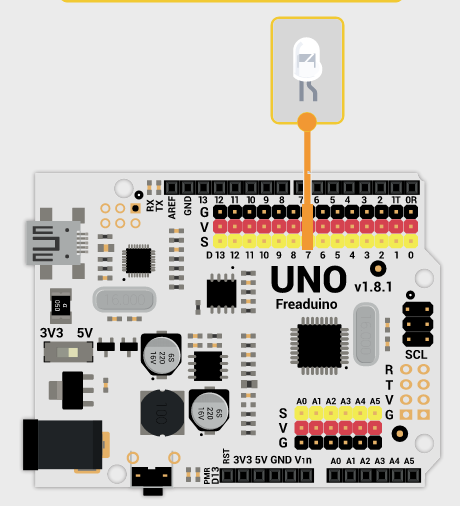

Para luego montarlo con los componentes

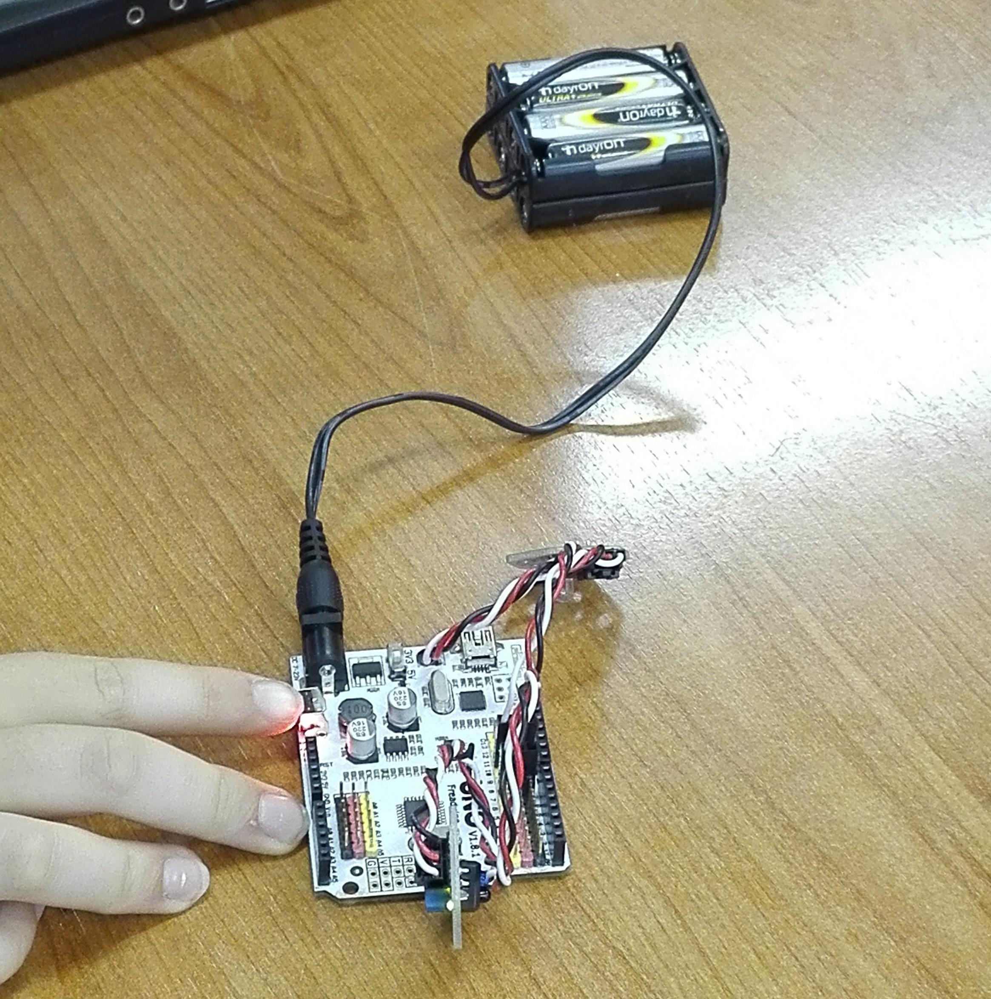

Pasamos ahora a la programación. Para ellos usamos un software gratuito que se llama [bitBloq](http://bitbloq.bq.com)

Empezamos haciendo un programa simple en el que hacemos que un led parpadee.

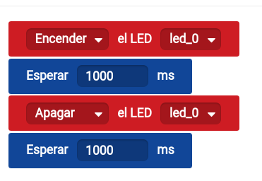

Aunque el programa es sencillo ya se han utilizado los conceptos de secuencia, espera, y han entendido velocidad a la que funciona el procesador.

Se han hecho con el interface del programa y han convertido valores entre unidades de tiempo.

Una vez terminado el programa lo han pasado  a la placa Arduino donde se ha ejecutado.

### Utilizando sensores

Luego hemos  utilizado un sensor de luz infrarroja, capaz de detectar obstáculos.

El montaje es sencillo, pero ya añade más componentes.

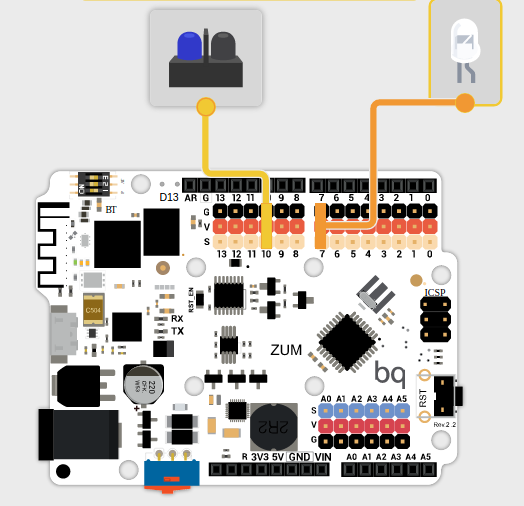

Hemos hecho un programa sencillo que nos avisa cuando detecta un obstáculo encendiendo un led

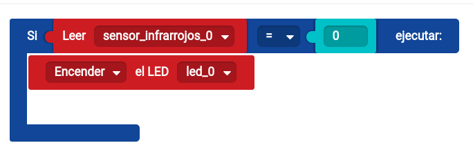

Para ello leemos el valor del sensor y hacemos una  comparación entre este valor y el esperado

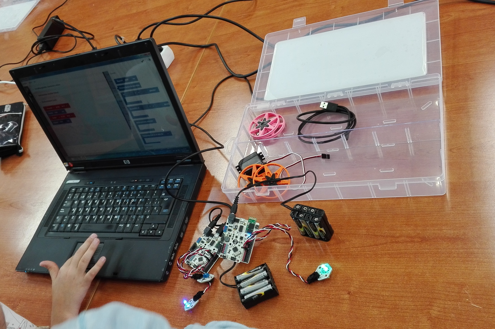

El próximo día conectamores y moveremos los motores...

# Día 13-5-2016

En este segundo día hemos estado trabajando con motores. En concreto hemos trabajado con motores de tipo servo.

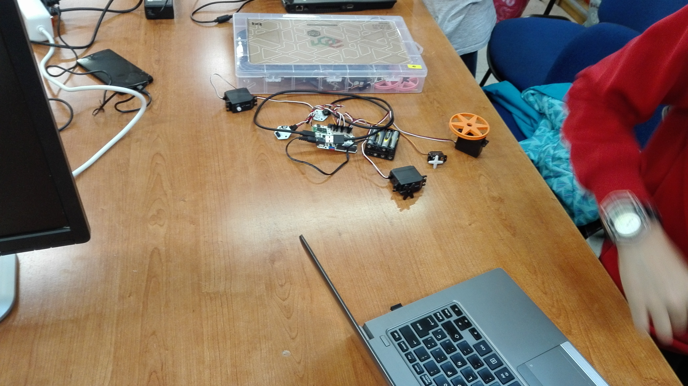

## Servos angulares

Primero hemos estado montando y programando motores de posicionamiento angular, para lo que hemos estado repasando los distintos tipos de ángulos y luego hemos montado un programa que movía los motores como si fuera el limpiaparabrisas de un coche.

El montaje ya les ha resultado muy sencillo...

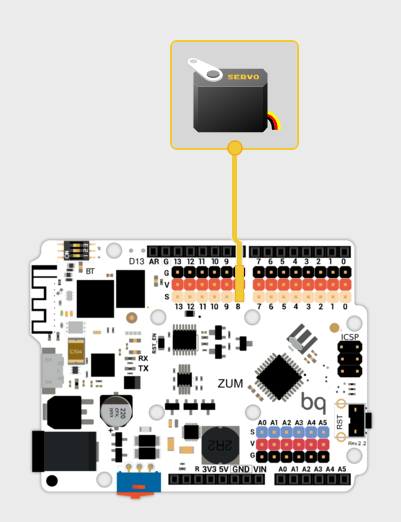

Y el programa lo ha hecho ellos solos sin problema.

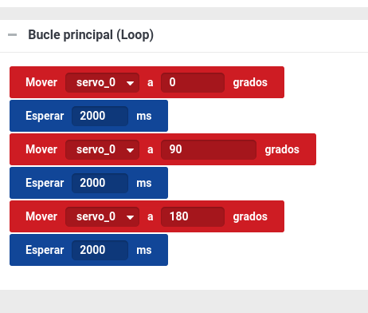

## Motores de rotación

Luego hemos estado trabajando con los motores de rotación continua que serán los que muevan las ruedas de los robots

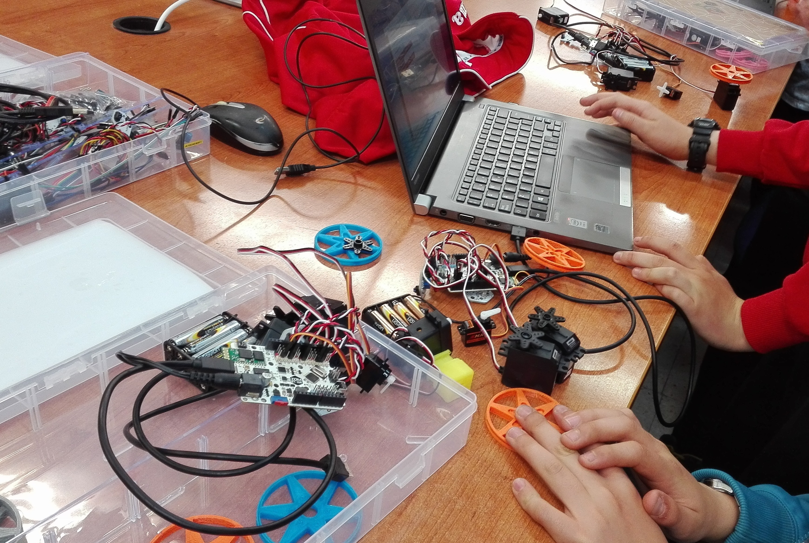

El  montaje era sencillo, y solo han tenido que revisar dónde conectarlos y cuidar de que la placa esté alimentada con las pilas.

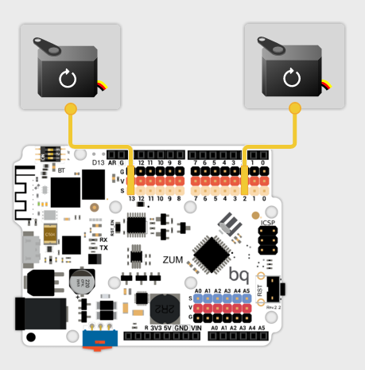

El programa que hemos hecho en esta parte ha sido sencillo y ya ha quedado preparado para unir todas las partes y hacer el programa del "robot que no se cae de la mesa", que haremos en la tercera sesión.

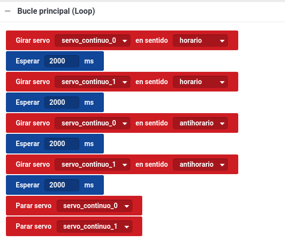

# Día 20-5-2016

El objetivo de hoy es montar todo el robot y con sus programa probarlo.

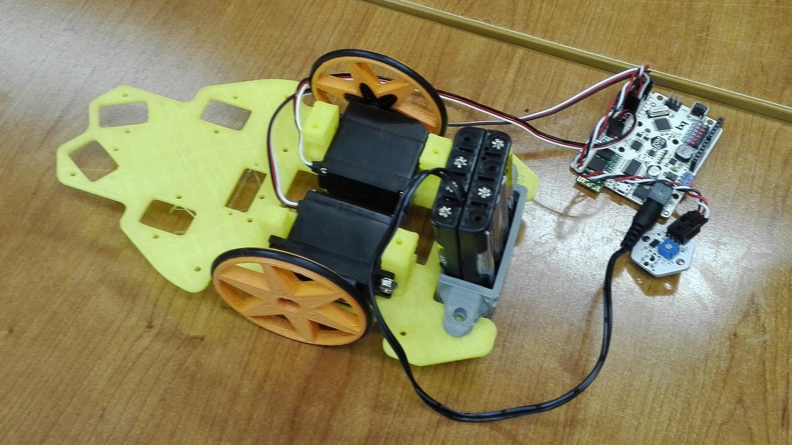

Haremos un programa que reune todo lo aprendido: motores y sensores.

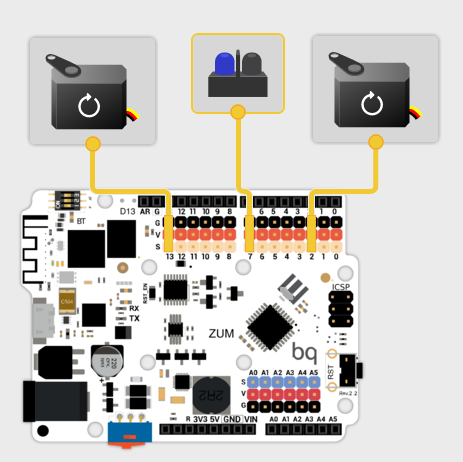

Usaremos un sensor infrarrojo y los motores. Cuando el sensor detecte que no hay suelo (o mesa) debajo (leerá el valor 0) invertirá el sentido de los motores y hará un giro. en caso contrario avanzará.

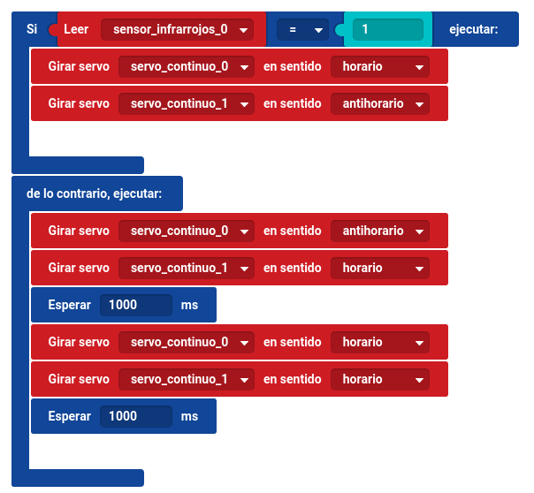

El robot queda montado así:

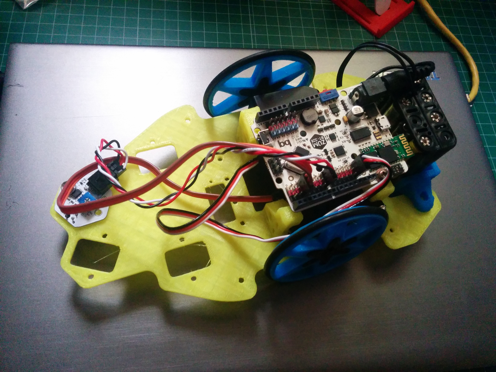

# ¡Quiero hacerme un robot!

Vamos a ver todos lo necesario para montarte tu robot.

## Estructura

Si te has fijado en las piezas habrás visto que no son muy complicadas y podrías hacerla con madera o cartón. Si quieres imprimirte un robot como el que hemos usado puedes encontrar los diseños [aquí](https://github.com/javacasm/evoPrintBot)

## Materiales

La lista de materiales usados:
* Freaduino
* Cable USB
* Sensor infrarrojo
* Cables
* Portapilas
* 2 x Servos de rotación continua

## [Programas](https://github.com/javacasm/Rob-ticaSierraNevada/tree/master/proyectos)

Todos los programas están hecho en [Bitbloq](http://bitbloq.bq.com)

* [Parpadeo](https://raw.githubusercontent.com/javacasm/Rob-ticaSierraNevada/master/proyectos/Parpadeo.json)
* [Sensores](https://raw.githubusercontent.com/javacasm/Rob-ticaSierraNevada/master/proyectos/Sensor_de_Luz.json)
* [Motores](https://raw.githubusercontent.com/javacasm/Rob-ticaSierraNevada/master/proyectos/motores.json)
* [Limpiaparabrisas](https://raw.githubusercontent.com/javacasm/Rob-ticaSierraNevada/master/proyectos/limpiaparabrisas.json)
* [Robot NoTeCaigas](https://raw.githubusercontent.com/javacasm/Rob-ticaSierraNevada/master/proyectos/NoTeCaigas.json)
